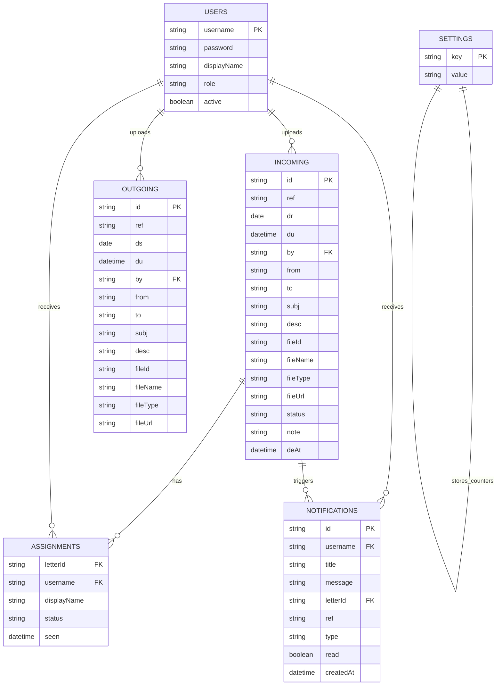

# Docshare ERD

The Google Sheet acts as the database. Each tab below is a table.

## Reference Number

The `ref` field is the office/document reference shown in the app.

When uploading an incoming or outgoing letter:

- enter an existing manual reference if the document already has one
- leave it blank to use the generated reference, such as `DEO_Batt_26_05_26_In_01`

## Attachments

Files are stored in Google Drive. The Sheet stores:

- `fileId`
- `fileName`
- `fileType`
- `fileUrl`

The binary file itself is not stored in the Sheet.
